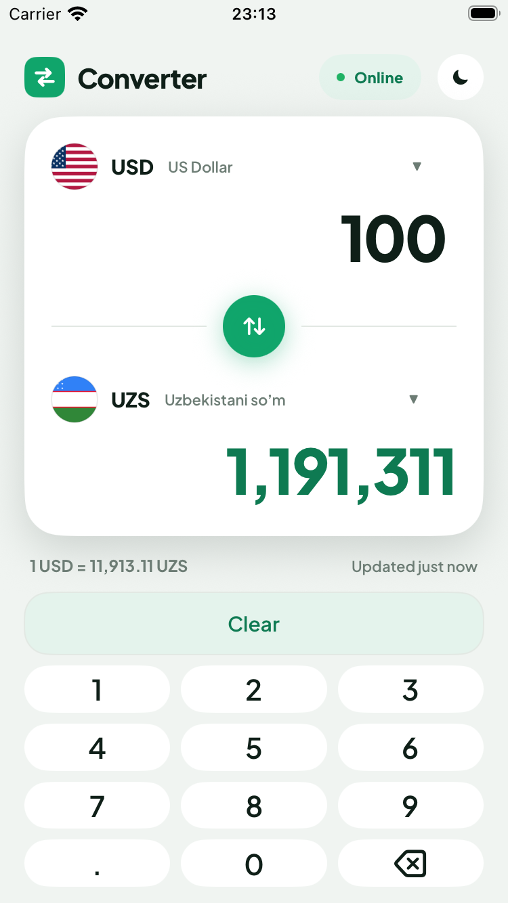
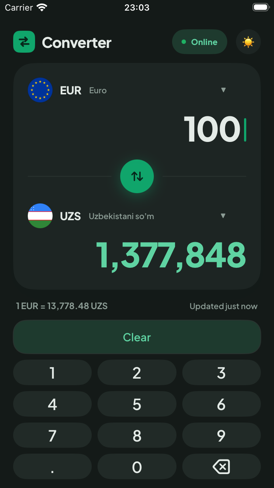
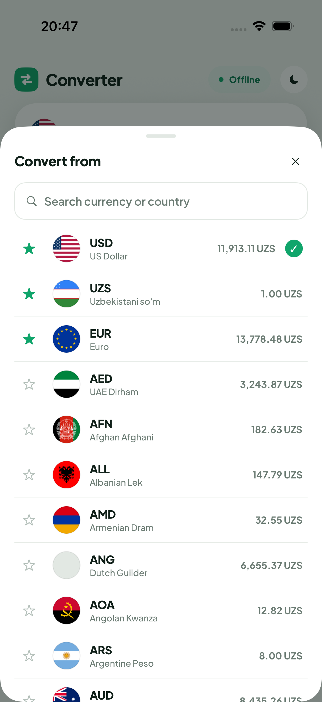
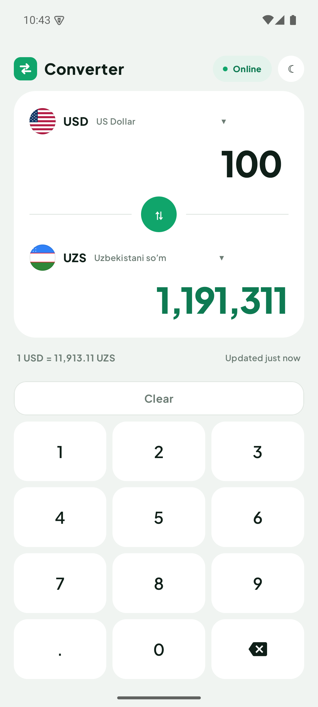
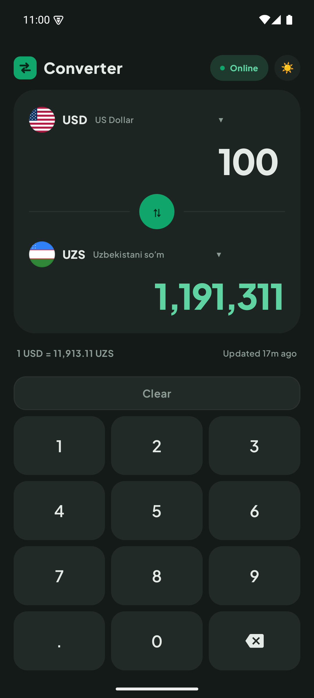
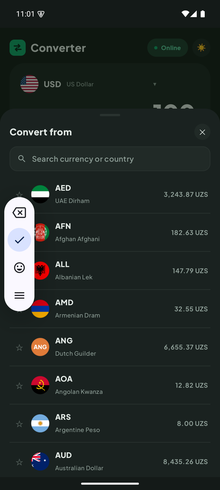

<div align="center">



# 💱 Currency Converter

**Offline-first currency converter — native iOS & Android.**
166 currencies · real exchange rates · works with zero network · free, no API key, no ads.

[](https://github.com/ismoilovdevml/currency-convertor/releases/latest/download/CurrencyConverter.apk)

[](https://github.com/ismoilovdevml/currency-convertor/actions/workflows/ci.yml)

[](LICENSE)

</div>

---

## 📥 Download

**Android:** [**Download the latest APK →**](https://github.com/ismoilovdevml/currency-convertor/releases/latest/download/CurrencyConverter.apk) — one tap, sideload, done.
Every tagged release ships an installable APK. iOS is built from source (see below).

---

## 📸 Screenshots

|  | Light | Dark | Currency picker |
|---|---|---|---|
| **iOS** <br/>SwiftUI |  |  |  |
| **Android** <br/>Compose |  |  |  |

---

## ✨ Features

- **Works fully offline** — a rates snapshot ships inside the app, so conversion works on first launch with no network.
- **Real conversion** — cross-rate math through a USD base: `result = amount ÷ rate[from] × rate[to]`.
- **166 currencies**, each with a circular flag (supranational currencies like XAF/XOF/XDR get a coloured code badge); live editing on either side with a tabular, auto-shrinking amount.
- **Automatic Online / Offline** — follows the real network state; no manual toggle. The meta row shows when rates were last updated ("Updated 5m ago").
- **⭐ Favourites** — star currencies; they sort to the top and persist (none starred by default).
- **Search** currencies by code or country, with a search icon and auto-focus.
- **Light & dark themes**, remembered across launches (along with your from/to pair and favourites).
- **Responsive** — the layout adapts from small phones to large tablets; the keypad never clips.

## 🏗️ How it works

Both apps share one data contract (`shared/`) and mirror the same layers:

```
UI (SwiftUI / Compose) → ViewModel → ConverterEngine (pure math, unit-tested)
                                   → RatesRepository
                                        ├─ Bundled seed   → offline on day one
                                        ├─ Local cache    → last fetched rates + timestamp
                                        └─ Remote (free)  → open.er-api.com → fawazahmed0 fallback
```

Rates are stored relative to **USD** (`USD = 1`). Offline is the default path; the network only *refreshes* the cache — it is never required to convert.

## 🚀 Build & run

**Android** (JDK 21 + Android SDK):
```bash
cd android
./gradlew assembleDebug        # build
./gradlew installDebug         # install on a running emulator/device
./gradlew testDebugUnitTest    # unit tests
```

**iOS** (Xcode 16+, [XcodeGen](https://github.com/yonaskolb/XcodeGen)):
```bash
cd ios
xcodegen generate
xcodebuild -scheme CurrencyConverter \
  -destination 'platform=iOS Simulator,name=iPhone 16 Pro' build
```

## 🗂️ Structure

```
shared/     currencies.json · seed-rates.json · flags/ · branding/   (single source of truth)
android/    Kotlin · Jetpack Compose (Material3) · DataStore
ios/        Swift · SwiftUI (MVVM) · XcodeGen
docs/       SPEC.md · screenshots/
.github/    CI (lint · test · build) · Release (tag → APK)
```

## 🛠️ Tech

`Kotlin` · `Jetpack Compose` · `Swift` · `SwiftUI` · `Coroutines` · `DataStore` · `GitHub Actions`

## 📄 License

[MIT](LICENSE) © 2026 ismoilovdevml
